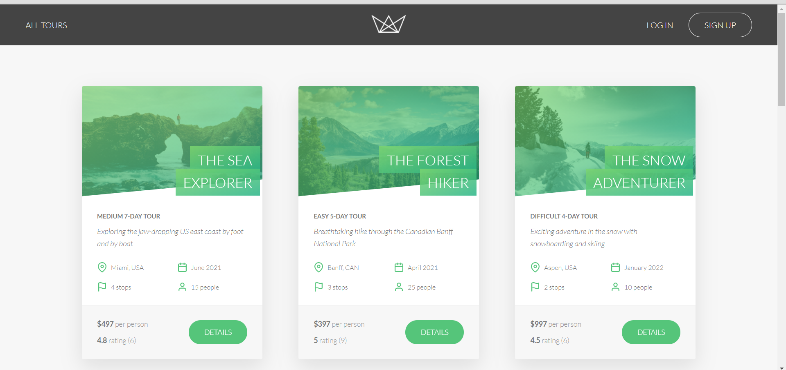

# Booking Application

It is a booking app where user can sign up,login,booking tours through ATM card.Booking is based on API and mongo,mongoose,express,nodeJs technology based.

---

## Table of contents

- [Features](#Features)
- [Technology](#Technology-Used)
- [Folder Structure](#Folder-Structure)
- [Quick Start](#Quick-Start)

---

## Features

- sign up with email
- update data (name,email,photo)
- forgot password with email-received token
- reset password when user sign in
- upload profile photo
- book tour with [stripe](https://stripe.com/en-in) card feature
- book with the card no (card no - 4242 4242 4242 4242 ,exp date-future date , cvv-222)
- user can see booking tour

---

## Technology

| Technology             | Version |
| ---------------------- | ------- |
| @babel/polyfill        | 7.11.5  |
| axios                  | 0.18.1  |
| bcryptjs               | 2.4.3   |
| compression            | 1.7.4   |
| cookie-parser          | 1.4.5   |
| cors                   | 2.8.5   |
| dotenv                 | 7.0.0   |
| express                | 4.17.1  |
| express-mongo-sanitize | 1.3.2   |
| express-rate-limit     | 3.5.3   |
| helmet                 | 3.23.3  |
| hpp                    | 0.2.3   |
| html-to-text           | 5.1.1   |
| jsonwebtoken           | 8.5.1   |
| mongoose               | 5.10.2  |
| morgan                 | 1.10.0  |
| multer                 | 1.4.2   |
| nodemailer             | 6.4.11  |
| pug                    | 2.0.4   |
| sharp                  | 0.22.1  |
| slugify                | 1.4.5   |
| stripe                 | 7.15.0  |
| validator              | 10.11.0 |
| xss-clean              | 0.1.1   |
| nodemon                | 2.0.4   |
| parcel-bundler         | 1.12.4  |

---

## Folder Structure

```
├─ config
│  └─ mongoose.js
├─ controllers
│  ├─ authController.js
│  ├─ bookingController.js
│  ├─ errorController.js
│  ├─ handlerFactory.js
│  ├─ reviewController.js
│  ├─ tourController.js
│  ├─ userController.js
│  └─ viewsController.js
├─ models
│  ├─ bookingModel.js
│  ├─ reviewModel.js
│  ├─ tourModel.js
│  └─ userModel.js
├─ public
│  ├─ css
│  │  └─ style.css
│  ├─ img
│  │  ├─ tours
│  │  │  ├─ tour-1-1.jpg
│  │  │  ├─ tour-1-2.jpg
│  │  │  ├─ tour-1-3.jpg
│  │  │  ├─ tour-1-cover.jpg
│  │  │  ├─ tour-2-1.jpg
│  │  │  ├─ tour-2-2.jpg
│  │  │  ├─ tour-2-3.jpg
│  │  │  ├─ tour-2-cover.jpg
│  │  │  ├─ tour-3-1.jpg
│  │  │  ├─ tour-3-2.jpg
│  │  │  ├─ tour-3-3.jpg
│  │  │  ├─ tour-3-cover.jpg
│  │  │  ├─ tour-4-1.jpg
│  │  │  ├─ tour-4-2.jpg
│  │  │  ├─ tour-4-3.jpg
│  │  │  ├─ tour-4-cover.jpg
│  │  │  ├─ tour-5-1.jpg
│  │  │  ├─ tour-5-2.jpg
│  │  │  ├─ tour-5-3.jpg
│  │  │  ├─ tour-5-cover.jpg
│  │  │  ├─ tour-5cdb06c8d87ca1051d90eda9-1557860998505-cover.jpeg
│  │  │  ├─ tour-5cdb06c8d87ca1051d90eda9-1557860998703-1.jpeg
│  │  │  ├─ tour-5cdb06c8d87ca1051d90eda9-1557860998703-2.jpeg
│  │  │  ├─ tour-5cdb06c8d87ca1051d90eda9-1557860998703-3.jpeg
│  │  │  ├─ tour-5f4bbed90064a24d601656ac-1598802271819-cover.jpeg
│  │  │  ├─ tour-5f4bbed90064a24d601656ac-1598802272550-1.jpeg
│  │  │  ├─ tour-5f4bbed90064a24d601656ac-1598802272551-2.jpeg
│  │  │  ├─ tour-5f4bbed90064a24d601656ac-1598802272552-3.jpeg
│  │  │  ├─ tour-6-1.jpg
│  │  │  ├─ tour-6-2.jpg
│  │  │  ├─ tour-6-3.jpg
│  │  │  ├─ tour-6-cover.jpg
│  │  │  ├─ tour-7-1.jpg
│  │  │  ├─ tour-7-2.jpg
│  │  │  ├─ tour-7-3.jpg
│  │  │  ├─ tour-7-cover.jpg
│  │  │  ├─ tour-8-1.jpg
│  │  │  ├─ tour-8-2.jpg
│  │  │  ├─ tour-8-3.jpg
│  │  │  ├─ tour-8-cover.jpg
│  │  │  ├─ tour-9-1.jpg
│  │  │  ├─ tour-9-2.jpg
│  │  │  ├─ tour-9-3.jpg
│  │  │  └─ tour-9-cover.jpg
│  │  ├─ users
│  │  │  ├─ default.jpg
│  │  │  ├─ user-1.jpg
│  │  │  ├─ user-10.jpg
│  │  │  ├─ user-11.jpg
│  │  │  ├─ user-12.jpg
│  │  │  ├─ user-13.jpg
│  │  │  ├─ user-14.jpg
│  │  │  ├─ user-15.jpg
│  │  │  ├─ user-16.jpg
│  │  │  ├─ user-17.jpg
│  │  │  ├─ user-18.jpg
│  │  │  ├─ user-19.jpg
│  │  │  ├─ user-2.jpg
│  │  │  ├─ user-20.jpg
│  │  │  ├─ user-3.jpg
│  │  │  ├─ user-4.jpg
│  │  │  ├─ user-5.jpg
│  │  │  ├─ user-5c8a1f292f8fb814b56fa184-1557847261269.jpeg
│  │  │  ├─ user-5c8a1f292f8fb814b56fa184-1557847910809.jpeg
│  │  │  ├─ user-5c8a21f22f8fb814b56fa18a-1557852619509.jpeg
│  │  │  ├─ user-5c8a21f22f8fb814b56fa18a-1557855123565.jpeg
│  │  │  ├─ user-5c8a21f22f8fb814b56fa18a-1557855245743.jpeg
│  │  │  ├─ user-5cdae0421c60052311ceec77-1557848268253.jpeg
│  │  │  ├─ user-6.jpg
│  │  │  ├─ user-7.jpg
│  │  │  ├─ user-8.jpg
│  │  │  └─ user-9.jpg
│  │  ├─ favicon.png
│  │  ├─ icons.svg
│  │  ├─ intro.png
│  │  ├─ logo-green-round.png
│  │  ├─ logo-green-small.png
│  │  ├─ logo-green.png
│  │  ├─ logo-white.png
│  │  └─ pin.png
│  └─ js
│     ├─ alerts.js
│     ├─ bundle.js
│     ├─ bundle.js.map
│     ├─ forgotSetting.js
│     ├─ index.js
│     ├─ login.js
│     ├─ mapbox.js
│     ├─ signup.js
│     ├─ stripe.js
│     └─ updateSettings.js
├─ routes
│  ├─ bookingRoutes.js
│  ├─ reviewRoutes.js
│  ├─ tourRoutes.js
│  ├─ userRoutes.js
│  └─ viewRoutes.js
├─ utils
│  ├─ apiFeatures.js
│  ├─ appError.js
│  ├─ catchAsync.js
│  └─ email.js
├─ views
│  ├─ email
│  │  ├─ _style.pug
│  │  ├─ baseEmail.pug
│  │  ├─ passwordReset.pug
│  │  └─ welcome.pug
│  ├─ _footer.pug
│  ├─ _header.pug
│  ├─ _reviewCard.pug
│  ├─ account.pug
│  ├─ base.pug
│  ├─ error.pug
│  ├─ forgot.pug
│  ├─ login.pug
│  ├─ overview.pug
│  ├─ resetpassword.pug
│  ├─ signup.pug
│  └─ tour.pug
├─ .gitignore
├─ app.js
├─ package-lock.json
├─ package.json
├─ readme.md
└─ server.js
```

## Quick Start

> Clone the git file with the below command:

```bash
   git clone https://github.com/ayushkumar731/booking-app.git
```

> install dependencies

```bash
    npm install
```

> make file with the name of **config.env** and set your all id's password ,sercret key etc..'

```bash
    NODE_ENV=development
    USERNAME=your username
    DATABASE=mongodb atlas link
    DATABASE_PASSWORD= your db password

    JWT_SECRET=random string
    JWT_EXPIRES_IN=1d
    JWT_COOKIE_EXPIRES_IN=1

    EMAIL_USERNAME=your email id
    EMAIL_PASSWORD=your email password
    EMAIL_HOST=smtp.gmail.com
    EMAIL_PORT=587

    EMAIL_FROM=Your email id

    STRIPE_SECRET_KEY=your sercret stripe key to use payment method

    STRIPE_WEBHOOK_SECRET=webhook secret key
```

> Start project by using command below

```bash
    npm start
```

> To run in the browser

```bash
    localhost
```

> **important** If you want to use payment with debit card smoothly, you have to deploy your project on heroku or anywhere and don't give real one debit card .This is for test purpose only. To test the payment option use below card number and details.

```bash
    card number-4242 4242 4242 4242
    exp data: future date in
    cvv : 222
    country: unites state

    and any thing you can feel in more options.
```

## links

- API link which is published on postman(some api url is restricted for user role) : https://documenter.getpostman.com/view/12172755/TVCfWTbE

- website link : https://natours731.herokuapp.com/

---


